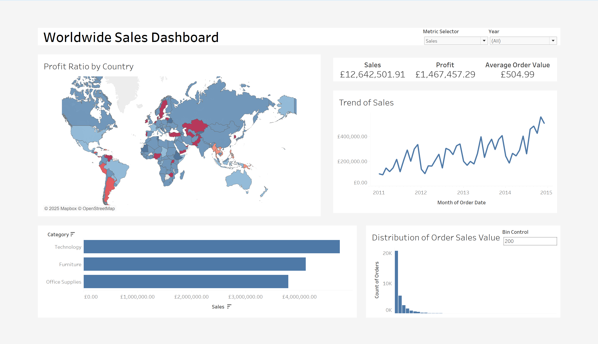
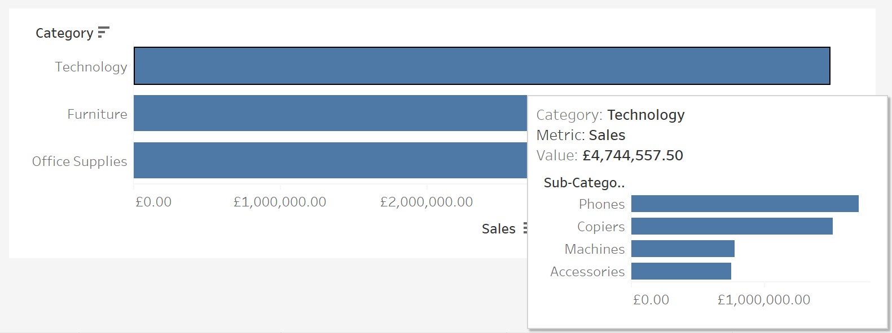
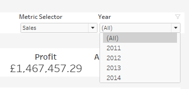
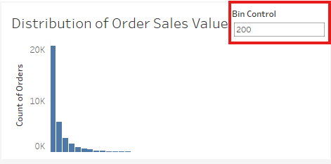
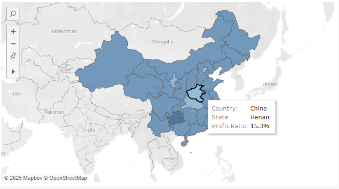
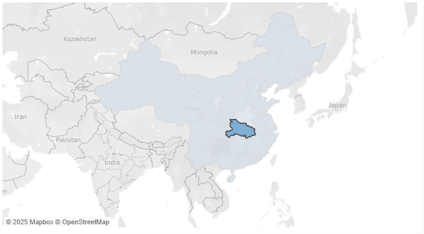

# Worldwide Sales Dashboard Manual

## Introduction
This Tableau dashboard provides insights into the sales and profit performance of a global level superstore. It is designed for managers and executives of the business and shows performance across countries, products and time.
Dashboard Overview
The Worldwide Executive Sales Dashboard consists of 4 visualisations as well as 3 KPI indicators, exploring the metrics of Sales and Profit. 

Figure 1: Overview of the Dashboard.

The components of the dashboard are described below:

* Top Left - Geographical heatmap (choropleth) of profit ratio by country.
* Top Right – KPI values of Sales, Profit and Average Order Value.
* Middle Right – A trend graph of a key metric over time.
* Bottom Left – A bar chart indicating total of key metric values per category. This gives product insight.
* Bottom Right – A histogram indicating the distribution of a key metric over the quantity of orders.

Deeper exploration of data is conducted via interactive filtering, parameter filtering, tooltips and drill down functionality.

## How to use the Dashboard

### Tooltips

Each visualisation has tooltip functionality when hovering over key components. 
The categorical bar chart has another visualisation in its tooltip, this surfaces sub-category data contextually. It is filtered so that the sub-categories shown in the visualisation are the ones that fall under the top-level category of the bar being hovered over.

Figure 2: Example of Categorical Bar chart tooltip.

### Filters
There are dashboard-level filters and visualisation level filters.
The global filters in the top right of the dashboard, shown in figure 3, can adjust the view across visualisations simultaneously. The metric selector chooses what metric the dashboard will show.

Figure 3: Global Filters.

The distribution visualisation has a bin control filter to adjust the size of the bins. This is in steps of 100 up to 2000 as a maximum value. To adjust the bin size, type into the box the size you would like outlined in figure 4.

Figure 4: Bin Control filter, a visualisation level filter.

### Interactive Filtering
Three of the visualisations have interactive filtering, when you click on a point in the visualisation the dashboard will filter its date to show all data for that point. This is included in the choropleth map, the product category bar chart and the trend graph.

### Drill-Down Function
To drill down into the map of profit ratio by country so that it shows the distribution of Profit Ratio by state:
1.	Hover over country you want to drill down into. Click the country.
2.	You will see the country zoomed in with the states visible.

Figure 5: State level choropleth of China.

3.	To use dynamic filtering for a state, click on the state.

Figure 6: Selected State.

4.	Click the state again to go back to country level, then click on the country once more to go to the global map.

## Key Metrics and Definitions

**Sales** – Total income received by the business for selling of goods.

**Profit** – Sales value minus the cost of the sale to the business.

**Profit Ratio** – Ratio of the profit compared to the sales value.

**Average Order Value** – The average value of an individual distinct order. The sum of Sales divided by the number of distinct orders.
